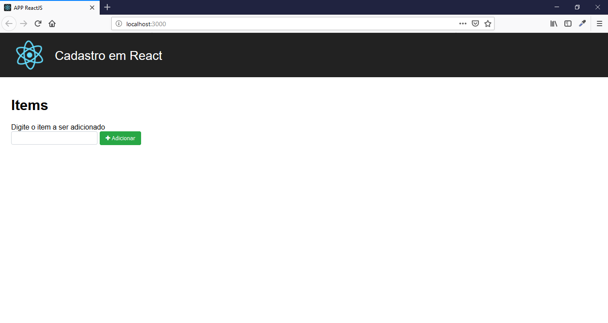
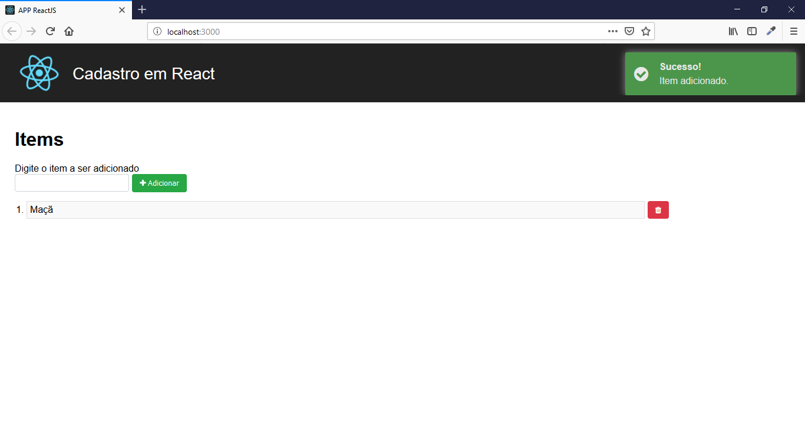
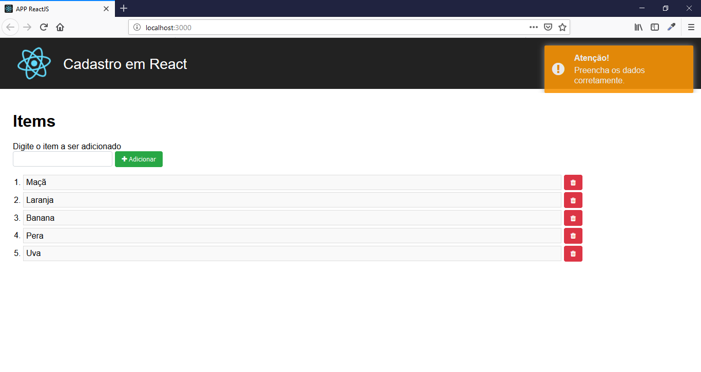
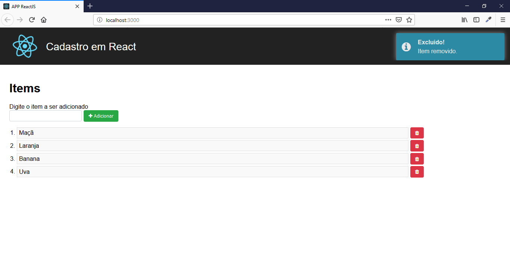
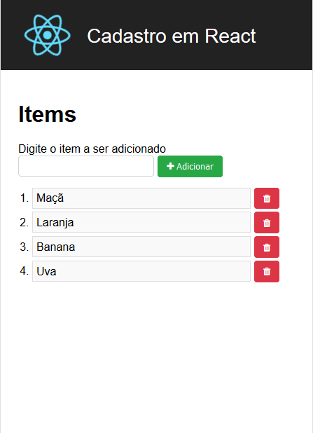

# APP ReactJS

Simples aplicativo de cadastro desenvolvido em ReactJS, sem o uso de banco de dados.

## Características
- CRUD
- Validation
- Notification

## Requisitos
- Node (NPM)

## Tecnologias
- React
- Javascript
- FontAwesome

## Instalação

```sh
$ git clone https://github.com/danilomeneghel/reactjs_app.git
$ npm install
```

Ao concluir a configuração, basta digitar no terminal:

```sh
$ npm start
```

Aguarde carregar todo o serviço web. <br>
Após concluído, abra o seu navegador o seguinte endereço: <br>

[http://localhost:3000/](http://localhost:3000/) 

## Demonstração

[https://reactjs-cadastro-items.herokuapp.com/](https://reactjs-cadastro-items.herokuapp.com/)

## Licença

APP ReactJS está sob licença <a href="LICENSE">The MIT License (MIT)</a>.

## Screenshots

<br><br>
<br><br>
<br><br>
<br><br>
<br><br>


Desenvolvido por<br>
Danilo Meneghel<br>
danilo.meneghel@gmail.com<br>
http://danilomeneghel.github.io/<br>
